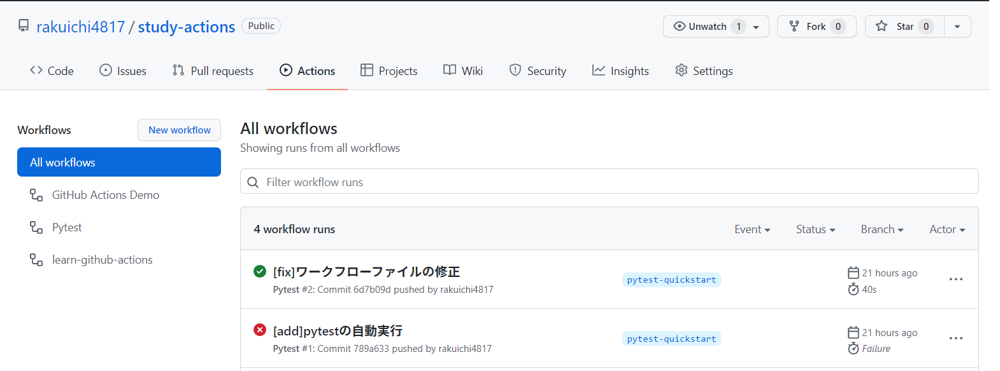
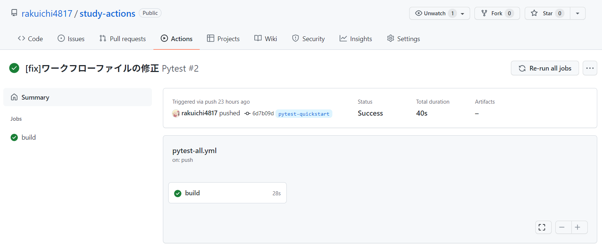

タイトルの通り、GitHub Actionsを用いてPythonのテスト自動化に取り組んでみました。テストについては、もちろんpytestを利用するのですが、今回はpythonパッケージの依存関係をpipenvで管理している場合を想定します。練習なので、最低限動作するレベルの内容であり、ベストプラクティスというわけではないのでご注意ください。

GitHub Actionsのワークフロー定義のみ見たいという方は「[#3-github-actionsのワークフローファイルの作成](#3-github-actionsのワークフローファイルの作成)」をクリックしてください。


## GitHub Actionsについて

詳細は触れませんが、簡単な紹介と参考ページのリンクを貼っておきます。

### 概要

GitHub Actionsは、GitHubのリポジトリに対して、様々な条件のトリガーを元に定義しておいた処理を実行する機能になります。トリガーにはプッシュやプルリクエストといった処理や定時実行などがあり、GitHubが提供するサーバー上の仮想マシンで実行できます。

無料枠における制限であったり、できることの説明は色々あるのですが、ここでは割愛させていただきます。

今回は、**「プッシュしたときにPythonコードのテスト(pytest)を実行する」** を目標にこちらを活用します。

### 公式ドキュメントと参考ページ

<div class="iframely-embed"><div class="iframely-responsive" style="height: 140px; padding-bottom: 0;"><a href="https://docs.github.com/ja/actions" data-iframely-url="//cdn.iframe.ly/NoxR6v1"></a></div></div><script async src="//cdn.iframe.ly/embed.js" charset="utf-8"></script>

<div class="iframely-embed"><div class="iframely-responsive" style="height: 140px; padding-bottom: 0;"><a href="https://knowledge.sakura.ad.jp/23478/" data-iframely-url="//cdn.iframe.ly/NWhFaV3"></a></div></div><script async src="//cdn.iframe.ly/embed.js" charset="utf-8"></script>

## 実際の構成やソース（サンプルプロジェクト）

以下のステップで進めていきます。

1. pipenv環境の構築
2. テスト対象プログラムとテストプログラムの作成
3. GitHub Actionsのワークフローファイルの作成
4. GitHubへのプッシュと確認

内容としては、**単純な足し算をする関数のテストをプッシュ時に実行する**、というものになります。

### 1. pipenv環境の構築

最近はPythonプログラムを作成する際、pipenvで環境を構築することが増えたので、今回もpipenvで環境を作っていきます。とはいっても、簡単な関数しか作成しないので、pytestのみインストールします。GitHub Actionsでは、このpipenvの仮想環境上でpytestを実行します。

```shell
# 仮想環境の作成（Pythonバージョン3.9系）
$ py -m pipenv --python 3.9
# pytestの導入
$ pipenv install pytest
```

### 2. テスト対象プログラムとテストプログラムの作成

#### 2.1 全体

実際に練習で作成したリポジトリはこちらです↓  
[https://github.com/rakuichi4817/study-actions/tree/pytest-quickstart](https://github.com/rakuichi4817/study-actions/tree/pytest-quickstart)

ファイル構成は以下のようになっています（一部省略しています）。よく見るファイル構成を元にして、srcディレクトリとtestsディレクトリを作成しています。srcディレクトリにメインとなるソース、testsディレクトリにテスト用ソースを置いています。

```text
.github/workflows         - GitHub Actions用ディレクトリ
└── pytest-all.yml        - ワークフロー定義ファイル
src
├── __init__.py
└── sample.py             - テスト対象コード
tests
├── __init__.py
└── test_sample.py        - pytestコード
Pipfile
Pipfile.lock
```

#### 2.2 テスト対象プログラムとテストプログラム

テスト対象となる足し算関数のプログラムと、その関数のテスト用プログラムを作成します。テストは成功するものを書いています（テスト名はtest_addの方がいい気がします）。

```src/sample.py
def add(a: int, b: int) -> int:
    return a + b
```

```tests/test_sample.py
from src.sample import add

def test_passing():
    print("---pass test---")
    assert add(1, 2) == 3
```

一旦ローカル上で、上記のテストが正しく動作するか確認しておきます。

```shell
$ study-actions> pipenv run pytest -v -s
============================== test session starts ===============================
platform win32 -- Python 3.9.6, pytest-6.2.5, py-1.11.0, pluggy-1.0.0 -- ~\study-actions\.venv\scripts\python.exe
cachedir: .pytest_cache
rootdir: ~\study-actions
collected 1 item

tests/test_sample.py::test_passing ---pass test---
PASSED

=============================== 1 passed in 0.03s ================================
```

問題なく実行されているのが確認できるかと思います。pytestについては勉強中なので、また別記事で学習記録でも書くつもりです。

### 3. GitHub Actionsのワークフローファイルの作成

GitHub ActionsでPython環境を作成するために、GitHub Marketplaceで提供されている「[Setup Python](https://github.com/marketplace/actions/setup-python)」を利用します。ワークフローの説明については省きますが、動作としては「リポジトリにプッシュした際にpytestを走らせる」というものになります。pipenvを利用しているのですが、こちらの対応は、上記リンクの公式ドキュメントに書いていましたので、ほぼそのまま利用しました。

本来であればビルドジョブとテストジョブを分けるべきなのでしょうが、今回はまとめています。

```.github/workflows/pytest-all.yml
name: Pytest
on: [push]
jobs:
  build:
    runs-on: ubuntu-latest
    steps:
      - uses: actions/checkout@v2
      - name: Install pipenv
        run: pipx install pipenv  
      - name: Set up pipenv
        uses: actions/setup-python@v2
        with:
          python-version: "3.9"
          cache: "pipenv"
      - run: pipenv install
      - name: Test with pytest
        run: pipenv run pytest -v -s
```

### 4. プッシュとActionsの確認

作成したコードをプッシュし、GitHubのリポジトリページにあるActionsタブを確認します。下図でみていくと、左側のWorkflowsの「Pytest」が今回作成したワークフローになり、右下には実際に走ったワークフローが確認できます。実は一度ワークフローファイルの定義でエラーがでたのですが、その時のログも残っています。



成功したときのワークフローログを見ます。前節でも書きましたが、今回は1つのジョブでテストまで走らせているので、表示されるジョブは「build」1つです。



「build」をクリックすると、詳細な処理ステップと出力を確認することができます。また、`>`をクリックすると各ステップの出力が表示されます。

ログを見ると、テストが成功していることを確認できます。さらに、こちらで定義したステップに加え、クリーンアップを行うステップが自動で追加されていました。



## まとめと今後

今回はGitHub Actionsを使った自動テストの練習として、pytestとpipenvを組み合わせたPythonのテストに挑戦しました。GitHub Actionsもpytestも勉強中なので、良くない書き方もしているかと思います。とはいえ、とりあえず動くものがあったほうが理解が進むので...。説明の中でも触れましたが、テストのジョブは分けるべきなのかな？と思ったりします。

テストに失敗したときに、ジョブとしては失敗になるのか試していないので、そちらも確認していきたいと思っています。これからも勉強を続けて、備忘録代わりに記事を書いていきます。